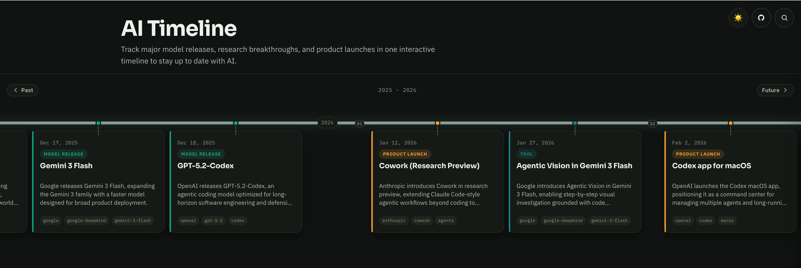

# 🤖 AI Timeline

**AI moves too fast to keep track of. This project fixes that.**

[](https://aitimeline.live/)
[]()
[](LICENSE)
[](CONTRIBUTING.md)

---

New models drop every week. Frameworks appear overnight. Yesterday's state-of-the-art becomes a footnote. If you blink, you miss a release that changes everything.

**AI Timeline** is an open-source, interactive timeline that tracks every major AI event — model releases, research breakthroughs, product launches, and open-source milestones — in one place you can actually browse and understand. 150 events from 1950 to today, updated continuously.

🔗 **[See it live at aitimeline.live](https://aitimeline.live/)**



## 💡 Why this exists

There is no single place that answers "what happened in AI this year?" in a visual, browsable format. Twitter threads get buried. Blog posts go stale. Wikipedia is dense. Newsletter archives are unsearchable.

This project is the answer: a community-maintained visual record of the AI landscape — past and present — that anyone can contribute to.

It's designed for:

- 🧑‍💻 **Developers** who want to understand when tools they use were released and how they relate to each other
- 🔬 **Researchers** tracking the evolution of architectures and techniques
- 📊 **Product people** following launches and industry shifts
- 🌍 **Anyone** who wants to make sense of what's happening in AI without drowning in noise

## ⚙️ How it works

Every event is a single Markdown file in the [`/events/`](events/) folder. A build script turns those files into a static site with search, filtering, and detail panels. No database, no backend, no framework — just static files deployed to GitHub Pages.

Adding an event takes 5 minutes:

1. 🍴 Fork this repo
2. 📝 Create a file in `/events/` named `YYYY-MM-slug.md`
3. ✏️ Fill in the frontmatter (title, date, category, summary)
4. 🚀 Open a Pull Request

That's it. The GitHub Action rebuilds everything automatically.

<details>
<summary><strong>📄 Event file example</strong></summary>

```markdown
---
title: "Claude Opus 4.6"
date: 2026-02-01
category: model-release
tags: [anthropic, claude, language-model]
short: "Anthropic releases Claude Opus 4.6 with improved reasoning and coding."
links:
  - label: "Announcement"
    url: "https://anthropic.com/news/..."
---

## What Happened

Describe the event factually.

## Why It Matters

Explain the significance.
```

</details>

## 🏷️ Categories

| Category | What goes here |
|---|---|
| 🧠 `model-release` | New model launched (GPT-4, Llama 3, Claude 3) |
| 🏗️ `architecture` | New architecture or technique (Transformer, MoE) |
| 🚀 `product-launch` | Product launched (ChatGPT, Copilot, Cursor) |
| 📄 `research` | Influential paper or breakthrough |
| 🔓 `open-source` | Notable open-source release |
| ⚖️ `regulation` | Policy, law, or governance event |
| 🏆 `milestone` | Benchmark record, adoption milestone |
| 🛠️ `tool` | Developer tool, framework, or infrastructure |

## 🖥️ Running locally

```bash
git clone https://github.com/imfurman/aitimeline.git
cd aitimeline
node scripts/build-index.js
npx serve .
```

No bundlers, no frameworks, no build tools. Just static files.

## 🧰 Tech stack

| Layer | Technology |
|---|---|
| 🎨 Frontend | Vanilla HTML, CSS, JavaScript |
| 📑 Markdown | [Marked.js](https://marked.js.org/) via CDN |
| 🔧 Build | Node.js script (generates JSON index, static pages, sitemap) |
| ♻️ CI/CD | GitHub Actions |
| ☁️ Hosting | GitHub Pages |

## 📁 Project structure

```
├── 📂 events/                 # One .md file per event (this is what you contribute)
├── 📜 js/app.js               # Main app logic
├── 📊 js/events.json          # Auto-generated index
├── 🌐 event/                  # Auto-generated static event pages (SEO)
├── 🎨 css/style.css           # Styles (dark/light themes)
├── 🔧 scripts/build-index.js  # Build script
├── 🏠 index.html              # Main page
├── 🗺️ sitemap.xml             # Auto-generated sitemap
└── ⚡ .github/workflows/      # CI/CD
```

## 🤝 Contributing

See [CONTRIBUTING.md](CONTRIBUTING.md) for the full guide. The short version:

- 📝 Create a Markdown file in `/events/` with the right frontmatter
- 📛 Follow the `YYYY-MM-slug.md` naming convention
- ✅ Write factually and cite sources
- 🔀 Open a PR

You can also improve existing events: fix errors, add links, expand descriptions.

## 📜 License

[MIT](LICENSE)

---

<p align="center">
  <strong>🔍 Know an AI event that's missing?</strong><br>
  <a href="CONTRIBUTING.md">Add it in 5 minutes ⚡</a>
</p>
